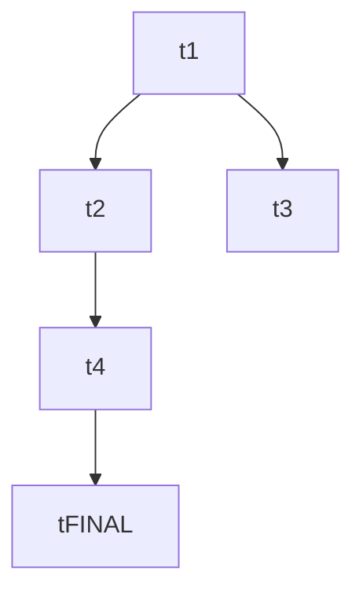

# Multi-Agent Orchestration

A repo-agnostic protocol for coordinating a multi-step change as a DAG of parallel PRs. One **coordinator** session (you, in chat) dispatches **builders**, **designers**, **reviewers**, and a final **audit** as subagents in isolated worktrees. State splits cleanly: the plan files own *what to build*; the git host (GitHub / GitLab / etc.) owns *execution lifecycle*.

The skill has **two modes** — planning (produce a plan) and execute (run that plan). The user picks via the invocation phrase.

## Modes and invocations

### Planning mode

Enter when the user says one of:

- `create multi-agent-orchestration-plan for <description>`
- `create multi-agent-orchestration-plan at <path> for <description>`
- `plan this as multi-agent-orchestration`

In planning mode, the coordinator (you, in chat) gathers any clarifying detail upfront, then dispatches the `mao-planner` subagent — which runs in an isolated worktree, drafts the plan, and ships it as a PR titled `[plan] <plan-name>`. The user reviews via the PR. Multiple plans can run in parallel. Full playbook: [references/planning-protocol.md](references/planning-protocol.md).

### Execute mode

Enter when the user says one of:

- `execute multi-agent-orchestration for <path>` — where `<path>` points to a markdown plan
- `resume multi-agent-orchestration at <path>` — after a session break

In execute mode, become the coordinator. Read the plan, derive state from the host, dispatch ready work to the named subagents below, run audit when done. Never merges.

## Working environment — what this skill expects

Before entering either mode, verify the environment. If a requirement is missing, surface it and ask whether to proceed with a degraded protocol or stop.

Read [references/environment.md](references/environment.md) for the full checklist and the **Repo config block** you should resolve once per plan. The short version:

- **Git repo** with a long-lived integration branch (typically `main`).
- **PR-based host** (GitHub, GitLab, Gitea) reachable from this session. PR access via **GitHub MCP** if available, otherwise `gh` / host CLI.
- **Worktree support in the agent harness** — subagents must accept `isolation: worktree`.
- **A plan location** — defaults to `docs/plans/<plan-slug>/`.
- **A quality-gate command** the builder runs before opening its PR — repo-specific (`./scripts/quality-fast.sh`, `pnpm run check`, `make test`, etc.). The plan declares this.
- **Robust project context** in `CLAUDE.md` / `AGENTS.md` / `docs/specs/**`. Plans and task cards do NOT carry project-specific guardrails; every subagent loads the repo's own context. **This includes repo-specific orchestration conventions:** before planning AND before/while coordinating, check `CLAUDE.md` / `AGENTS.md` (and any docs they point to) for multi-agent-orchestration rules this repo requires — e.g. mandatory gate / checkpoint tasks and their cadence, slow-lane / merge / CI policy, branch conventions — and incorporate and follow them. When stricter than the generic defaults here, the repo's rules win.

If the host has no PR concept (raw git, mercurial), this skill does not apply.

## Roles and named subagents

The skill ships with five subagent definitions in the bundle's `agents/` directory, installed at `~/.claude/agents/mao-*.md` (via `install.sh` symlink). Each pins `model: opus`, `effort: xhigh`, and `isolation: worktree` at the harness level. **Dispatch by name** (`subagent_type: "mao-builder"`, etc.) and the harness enforces the configuration.

| Role | Agent name | Isolation | Used in |
| --- | --- | --- | --- |
| Planner | `mao-planner` | worktree | planning mode |
| Builder | `mao-builder` | worktree | execute mode |
| Designer | `mao-designer` | worktree | execute mode |
| Reviewer | `mao-reviewer` | worktree | execute mode |
| Audit | `mao-audit` | worktree | execute mode, once |

All five run in isolated worktrees — none can interact with the user mid-flight. Every interactive moment (clarification, sign-off, review) happens either in the parent chat (before dispatch) or in PR review (after).

The coordinator session itself is YOU — running in chat, not as a named subagent. The coordinator should also be on Opus + xhigh.

## Plan layout — split files

```
<plan-root>/
  plan.md            # index — Goal, Outcomes, Orchestration, DAG, Tasks (links), Deviations log
  tasks/
    t1.md            # one file per task
    t2.md
    …
    tFINAL.md        # mandatory final test card
  designs/           # created by designers at execute time
    t2.md
  status.md          # MANDATORY — orchestrator's running log (created at first iteration)
```

`plan.md` is the index. Task cards live in `tasks/<id>.md` — they are NOT inlined in `plan.md`. The orchestrator creates `status.md` at first iteration and appends to it every iteration thereafter.

`plan.md` skeleton — see [references/templates.md](references/templates.md) for the full template:

```markdown
# Plan: <name>

## Goal
One paragraph.

## Outcomes
- <observable, specific, testable, bounded>
- <…>

## Orchestration
- Status: enabled
- Plan slug: `<plan-slug>`
- Integration branch: `main`
- Host: github | gitlab | gitea
- Host access: mcp | gh | glab
- Quality-gate command(s): `<command>`
- Deviations from default protocol: <none / list>

## DAG


## Tasks
- [t1: <title>](tasks/t1.md) — build
- [t2: <title>](tasks/t2.md) — design
- …
- [tFINAL: verify plan outcomes](tasks/tFINAL.md) — build (final test card)

## Deviations log
<empty until first merge>
```

The DAG is the **single source of truth** for dependencies.

## Task card template (lives in `tasks/<id>.md`)

```markdown
# <task-id>: <title>

**Type:** build | design
**Problem:** what's the issue and why it matters.
**Inputs:** dep task ids and (for tasks downstream of a design) `designs/<design-id>.md ## Decision`.
**Outcomes:** specific, observable things that must be true after this lands.
**Output artifact:** files/paths/symbols (build) or `designs/<id>.md` (design).
**Out of scope:** explicit boundaries.
```

## Task types and sizing

Two output shapes:

- **Build task** — ships a PR with code, tests, docs. **Sized to ≤ ~2000 added or modified lines per PR.** Deletions don't count toward the budget (refactor tasks that net-remove are fine). Tests count. If a task would exceed the budget, the planner must split.
- **Design task** — ships a PR landing one canonical `designs/<task-id>.md` (answering ONE question, producing ONE decision) and pointer-only updates to downstream `tasks/<id>.md` files. The design doc is canonical; cards reference it, never restate it. Designs follow strict writing rules (alternatives + rationale, no code, succinct, simplest, < 200 lines). Full protocol: [references/design-protocol.md](references/design-protocol.md).

### The mandatory final test card

**Every plan ends with a final test card** — a build task whose job is to assert each plan-level outcome with automated tests. It's the sink of the DAG; every other task is a dependency. The audit later verifies that the test card actually exercises each plan outcome.

Optional only for plans with genuinely untestable outcomes, with explicit justification in the planner's PR body. Default: include.

## Input to next task — the hand-off contract

**Every task explicitly declares what it produces for downstream tasks**, and the coordinator verifies that artifact exists before dispatching a dependent.

| Task type | Hand-off artifact | Coordinator pre-dispatch check |
| --- | --- | --- |
| Build | Merged PR; code paths listed in `Output artifact` exist on the integration branch. | `git log <integration>..<pr-merge-sha>` touches expected paths; PR is merged. |
| Design | Merged PR landing **the canonical `designs/<id>.md`** and pointer-only updates to downstream task files. | `designs/<id>.md` exists with one `## Decision` section; at least one downstream `tasks/<id>.md` references the doc (under `Inputs` or via `> Updated from <id>: see designs/<id>.md` pointer marker). Cards must NOT restate the design's content. |
| Final test card | Merged PR; test files at the paths declared in `Output artifact`; tests reference each plan outcome. | Test files exist; tests pass in the quality gate (the audit will run them on the integration branch). |

**The design doc is canonical.** Cards point to it; they never duplicate its content. This rule prevents drift.

If the pre-dispatch check fails, **do not dispatch the dependent** — surface to the user.

When dispatching a downstream builder, the subagent prompt MUST cite the design doc explicitly. When dispatching a **designer**, the prompt MUST include prior design docs from the same plan AND outcomes of merged prior tasks — designers must compose with prior decisions.

## Lifecycle

```
pending  ──(coordinator dispatches builder/designer)──▶  open
open     ──(reviewer: approve)──────────────────────────▶  approved
open     ──(reviewer: request-changes)──────────────────▶  open (builder re-dispatched)
approved ──(human merges)───────────────────────────────▶  merged
```

State is derived from the host every iteration.

| Host observation | Task state |
| --- | --- |
| No PR with title `[<id>] …` | pending |
| PR open; no fresh `[reviewer]` review | ready for review |
| Fresh `[reviewer]` review first line: `Verdict: CHANGES_REQUESTED` | needs re-dispatch |
| Fresh `[reviewer]` review first line: `Verdict: APPROVED` | approved (human to merge) |
| PR closed and merged | merged |

A reviewer review is **fresh** when its `submittedAt` is newer than the PR's latest commit timestamp.

## Host protocol (PR conventions)

- **PR title:** `[<task-id>] <task title>`. The planner uses `[plan] <plan-name>`; audit uses `[audit] <plan-name>`.
- **PR body — four sections:** Summary / Outcomes (card checkboxes) / Standard checklist / Deviations from card. Full template in [references/templates.md](references/templates.md).
- **Reviewer verdict:** first line is `Verdict: APPROVED` or `Verdict: CHANGES_REQUESTED`. Subsequent lines cite each unmet item.
- **Identity:** all agents commit as the user. Role encoded in PR-comment prefixes (`[builder]`, `[reviewer]`, `[designer]`, `[planner]`, `[coordinator]`, `[audit]`).

For host-specific MCP / CLI tool mappings, see [references/templates.md](references/templates.md) §Host protocol.

## Concurrency

- Builders/designers: **≤ 4 in flight by default** (plan can override).
- Reviewers: **unbounded**.
- Coordinator: **one** (you). Iterations sequential.

## Quality gates

Builders run the plan-declared quality-gate command(s) inside their worktree before opening the PR. The PR's Standard checklist asserts the pass.

The coordinator does NOT re-run the gate from the integration branch — the builder asserts it; reviewers + CI catch regressions. The audit step DOES re-run it on the integration branch at the end of the plan.

## Progress tracking, deviations, and orchestrator consistency

This is the discipline that keeps a multi-agent plan coherent across iterations. Read [references/deviations-and-progress.md](references/deviations-and-progress.md) for the full protocol. Essentials:

### Plan vs. task edits — keep `plan.md` stable

`plan.md` is the user's commitment — Goal, Outcomes, DAG, task list. It is mostly stable. Updates flow to the task files in `tasks/<id>.md` instead. The bar for editing `plan.md`: "does a pending task still have the right context?" If yes, leave `plan.md` alone. If no (structural change, plan-outcome refinement, new task), update.

### `status.md` — mandatory, orchestrator maintains it

Every plan has a `status.md` at the plan root. The orchestrator creates it on first iteration and appends one entry per iteration thereafter — dispatched/merged/stuck + free-text notes. The audit reads it; resumed sessions reconstruct from it.

### Per-iteration loop

1. Re-read `plan.md` only if the previous iteration edited it. Always query the host for PRs matching the plan slug.
2. Compute a state diff vs. the previous iteration.
3. **Process newly-merged PRs**: append to plan's `## Deviations log`, verify hand-off artifacts, propagate pointer markers to affected `tasks/<id>.md` files.
4. **Consistency check** — if ≥ 2 design tasks merged this iteration, run an explicit cross-check on their decisions (do they compose? do they invalidate downstream cards?). For a single design merge, do a lighter version of the same check. See [references/deviations-and-progress.md](references/deviations-and-progress.md) §Consistency check.
5. Identify ready work using DAG + hand-off check.
6. Dispatch in parallel (one message, multiple `Agent` calls).
7. Append the iteration entry to `status.md`.

### On each merge

**First, sync the coordinator to the integration branch.** A merge advances `main`, so before anything else `git fetch` and bring the coordinator's local checkout up to the merged integration branch (e.g. `git reset --hard origin/main` in the coordinator worktree). Every subsequent step — hand-off verification, `plan.md` / `status.md` edits, the consistency check, dispatch-readiness, and especially the final audit — must run against the *current* integration branch. A coordinator operating from a stale base (its worktree cut at an earlier `main` and never re-synced) silently verifies, edits, and audits the wrong tree: e.g. running the test gate against stale code yields a pass/count that looks fine but proves nothing about what actually merged.

1. Append to `plan.md` `## Deviations log`: `- <task-id> (PR #N, merged YYYY-MM-DD): <one-line summary>`. Log even if no deviation (use `none`).
2. Propagate to affected pending `tasks/<id>.md` files as **pointer markers** (`> Updated from <id>: see PR #N's ## Deviations from card`) — not restatements. Same rule as design hand-off.
3. Do NOT edit in-flight cards (their subagent loaded the old contract). Append a follow-up task instead.
4. If a hand-off artifact was promised but not produced, flag before continuing.

**Stuck-task watch:** ≥ 3 iterations without movement → surface to user.

## Disputes

If a reviewer requests changes twice on the same PR without converging:

1. Stop re-dispatching the builder.
2. Post a `[coordinator]` comment summarising the disagreement.
3. Surface the PR to the human.

## Audit

Runs **once**, after every task is merged. Dispatch `mao-audit`. Checks:

- Plan-level outcomes are tested by the final test card (1:1 or coherent groups); the test card's tests pass on the integration branch.
- Plan-level outcomes are satisfied by merged PRs end-to-end.
- `plan.md` `## Deviations log` has an entry per merged PR.
- `status.md` spans the plan's execution (gaps mean lost work — surface).
- Hand-off artifacts exist at all declared paths.
- No `tasks/<id>.md` restates a design doc's content.
- Quality gates pass on the integration branch.

**Pass:** coordinator surfaces the audit's PR/note and proposes deleting `<plan-root>/`. **Fail:** audit appends remediation cards (new files under `tasks/`) + DAG edges; orchestration resumes.

## Coordinator loop (execute mode, event-driven)

Each iteration:

1. **Refresh state.** Always `git fetch` and re-derive PR state from the host, and **keep the coordinator's local checkout synced to the latest integration branch** (never operate from a base cut at an earlier `main` — a stale checkout makes every gate/hand-off/audit run against the wrong tree). First invocation: read `plan.md` + `status.md`. Otherwise: re-read only if previous iteration edited.
2. **Process newly-merged PRs.** Deviations log, hand-off verification, pointer-marker propagation.
3. **Consistency check** after design merges (especially parallel).
4. **Identify ready work.** Pending tasks with all DAG deps merged AND hand-off artifacts present; open PRs without a fresh reviewer review.
5. **Dispatch in parallel** — one message, multiple `Agent` calls. For designers, include prior designs + prior outcomes in the prompt.
6. **Wait for the batch.** Completion is the next event.
7. **Append to `status.md`.** One entry per iteration.
8. **Decide next.** More work and no human action needed → loop. Otherwise surface human-action items and end the turn.

**Resumption.** New session: re-read `plan.md` + `status.md`, re-derive state from host, re-verify hand-offs, re-run the consistency check for the most recent design merges.

**No autonomous merge.** Coordinator never merges PRs.

## Subagent prompting

Subagents do not see the chat history. The `Agent` prompt must be self-contained. Full templates in [references/templates.md](references/templates.md). Key per-role notes:

- **Builders** — cite the plan index, the task file path (`<plan-root>/tasks/<id>.md`), any cited design doc, the size budget, and the quality-gate command.
- **Designers** — cite the task file path, the design protocol; **include prior design docs from the same plan and outcomes of merged prior tasks**. Designers must compose with prior decisions; without this context they produce conflicting designs.
- **Reviewers** — cite the PR number, the task file path, the verdict format.
- **Audit** — cite the plan, `status.md`, the final test card's test files.
- **For all** — require loading repo `CLAUDE.md` / `AGENTS.md` / `docs/specs/**`, **including any repo-specific multi-agent-orchestration conventions stated there (e.g. required gate/checkpoint tasks, cadences, merge/CI policy) — those are binding.**
- **For all** — the prompt MUST instruct the agent to `git fetch origin` and branch from the **latest** integration branch (`origin/<integration-branch>`, e.g. `origin/main`) at the start of its run — NOT from whatever base its worktree happens to start at, which may be stale (other tasks merged since). Branching from a stale base causes spurious conflicts, missing dependencies, and gates that run against the wrong tree. For a re-dispatch onto an existing PR branch, instruct it to fetch and check out the latest origin head of that branch (and, when appropriate, merge the latest `origin/<integration-branch>` in).
- **For all** — the plan, task cards, and design docs are **ephemeral** (the audit deletes `<plan-root>/` when the plan lands). Durable artifacts — source, code comments, test names/comments, docs, commit messages — must NOT reference plan/card/design identifiers or `docs/plans/...` paths (e.g. `t5b`, `t2 §7.2`, the plan slug, `tFINAL`). Comments must be self-contained. The PR title's `[<task-id>]` tag, the PR body, and the orchestrator's `status.md` / `## Deviations log` are exempt (transient host/plan state, not the codebase). In particular, do NOT add a `*-Agent:` commit trailer that carries a task id or plan slug — that lands an ephemeral identifier in permanent git history; record role/provenance through the exempt PR title tag and the role-prefixed PR comments instead. Builders grep their diff for these before opening the PR; reviewers reject any that leaked into durable files.

You do NOT need to repeat `model: opus`, `effort: xhigh`, or `isolation: worktree` — the `mao-*` agent definitions pin those.

## References

- [references/planning-protocol.md](references/planning-protocol.md) — planning mode: outcomes, sizing, final test card, split layout
- [references/environment.md](references/environment.md) — repo-agnostic environment checklist
- [references/design-protocol.md](references/design-protocol.md) — design task workflow, writing rules, acceptance criteria
- [references/templates.md](references/templates.md) — plan.md index, task file, final test card, PR body, subagent prompt templates
- [references/deviations-and-progress.md](references/deviations-and-progress.md) — status.md, deviations log, hand-off verification, consistency check
