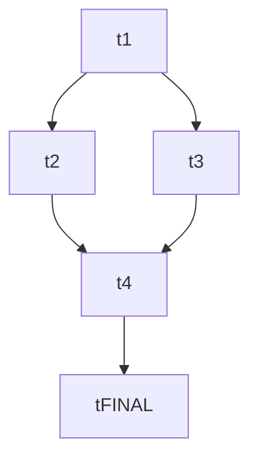

# Templates — plan, cards, PR body, subagent prompts

Concrete templates you can copy. Adapt placeholders (`<…>`) to the repo and plan.

## Plan layout — split files

The default layout splits the plan index and the task cards into separate files. `plan.md` is the index; each task is its own file under `tasks/`.

```
<plan-root>/
  plan.md                 # index — goal, outcomes, orchestration, DAG, task list, deviations log
  tasks/
    t1.md
    t2.md
    …
    tN.md                 # final test card (mandatory)
  designs/                # created at execute time by designers
    t2.md
  status.md               # mandatory — orchestrator's running log
```

## `plan.md` (the index)

```markdown
# Plan: <name>

## Goal
One paragraph: what this plan achieves and why.

## Outcomes
Observable, specific, testable, bounded. The final test card verifies these.

- <outcome 1, written so a test can assert it>
- <outcome 2>
- <…>

## Orchestration
- Status: enabled
- Plan slug (for PR filtering): `<plan-slug>`
- Plan root: `docs/plans/<plan-slug>/`
- Integration branch: `main`
- Host: `github` | `gitlab` | `gitea`
- Host access: `mcp` | `gh` | `glab`
- Quality-gate command: `<command>` or `N/A`
- Builder concurrency cap: 4
- Reviewer concurrency cap: unbounded
- Deviations from default protocol: <none / list>

## DAG


## Tasks
- [t1: foundation — auth session module](tasks/t1.md) — build
- [t2: decide idempotency layer](tasks/t2.md) — design
- [t3: implement sync engine per t2](tasks/t3.md) — build
- [t4: wire UI to session](tasks/t4.md) — build
- [tFINAL: verify plan outcomes](tasks/tFINAL.md) — build (final test card)

## Deviations log

<empty until first merge>
```

## Task card — `tasks/<id>.md`

```markdown
# <task-id>: <title>

**Type:** build | design
**Problem:** what's the issue and why it matters.
**Inputs:** what must be true before this starts — typically dep task ids and (for build tasks downstream of a design) `designs/<design-id>.md ## Decision`.
**Outcomes:** specific, observable things that must be true after this lands. Map back to plan outcomes when applicable.
**Output artifact:** what the next task needs from this. For build: file paths + symbols. For design: `designs/<id>.md`.
**Out of scope:** explicit boundaries.
```

(No `**Model:**` field — the `mao-*` named subagents pin opus + xhigh. Only add a `Model:` line if a specific task overrides, with the user's agreement.)

## Final test card — `tasks/tFINAL.md` (or similar)

```markdown
# tFINAL: verify plan outcomes

**Type:** build
**Problem:** Verify that the plan's outcomes are delivered end-to-end. This task is the contract with the human — its tests must fail if an outcome is missed.
**Inputs:** All other tasks merged. Read the plan-level `## Outcomes` section verbatim.
**Outcomes:**
- One automated test (or coherent test group) per plan outcome, asserting the outcome holds on the integration branch.
- All tests run in the repo's quality gate / CI.
- Tests fail if a plan outcome is broken; tests pass if every outcome holds.
**Output artifact:** `<test files at conventional location for this repo>` — list each file the audit can grep for.
**Out of scope:** Bundling unrelated test improvements. Tests that exercise individual task outcomes (those belong on the task cards that produced them).
```

## Task card with a downstream design reference

```markdown
# t3: implement sync engine

**Type:** build
**Problem:** Ship the sync engine per the decision in t2.
**Inputs:** t2 merged; binding contract in `designs/t2.md ## Decision`.

> Updated from t2: see `designs/t2.md ## Decision` for the idempotency-layer contract this task implements.

**Outcomes:**
- POST /api/sync returns `{cursor, applied}` for valid batches.
- Conflicting writes return 409 with `{conflicts}`.
- Tests cover the happy path and the conflict path.
**Output artifact:** `src/sync/engine.ts` exports `applySync(batch) -> Promise<SyncResult>`; route `POST /api/sync` registered in `src/api/routes.ts`.
**Out of scope:** UI wiring (t4).
```

Note: the marker is a *pointer* (`see designs/t2.md ## Decision`), not a restatement of the decision.

## `status.md` — orchestrator's running log (mandatory)

The orchestrator appends one entry per iteration. Template:

```markdown
# Status: <plan-name>

## YYYY-MM-DD HH:MM — iteration N
- Dispatched: t3 (builder), t4 (reviewer)
- Merged this iter: t1 (no deviation)
- Stuck: t5 (4 iter, awaiting human merge of t2)
- Notes: <free text — consistency observations, parallel-design conflicts noticed, anything useful for debugging or retro>

## YYYY-MM-DD HH:MM — iteration N+1
…
```

The audit reads this. Resumed sessions consult it to reconstruct what happened.

## PR body (any task)

```markdown
## Summary
One paragraph: what shipped and why.

## Outcomes
- [ ] <outcome 1 from the card>
- [ ] <outcome 2 from the card>

## Standard checklist
- [ ] Quality-gate command passes locally: `<command from plan>`
- [ ] Tests added/updated where appropriate (or `N/A` for design tasks)
- [ ] Hand-off artifact exists at the path declared in `Output artifact`
- [ ] Docs / spec updates per repo conventions (or `N/A`)
- [ ] No ephemeral-plan references in durable artifacts: source, comments, tests, and commit messages cite no plan/card/design ids or `docs/plans/...` paths

## Deviations from card
<empty if none — otherwise one line per deviation>
```

## Reviewer verdict comment

First line is the verdict, exactly. Body follows.

```
Verdict: APPROVED

All outcomes satisfied. Quality gate passed. Hand-off artifact present at `src/auth/session.ts`.
```

or:

```
Verdict: CHANGES_REQUESTED

- Outcome 2 ("login screen reads session via hook") not addressed — `LoginScreen.tsx` still imports `useAuth` directly.
- Standard-checklist gate command not declared in PR body.
```

## Host protocol — tool mapping

When the plan declares `host-access: mcp` and the host is GitHub:

| Action | Tool |
| --- | --- |
| List PRs in the plan | `mcp__github__list_pull_requests` — filter client-side on title prefix `[<task-id>]` or plan slug |
| Read PR details/reviews/commits/files | `mcp__github__pull_request_read` with `method: "get" \| "getReviews" \| "getComments" \| "getFiles"` |
| Open a PR | `mcp__github__create_pull_request` |
| Update a PR | `mcp__github__update_pull_request` |
| Post review verdict | `mcp__github__pull_request_review_write` — if same-identity restriction blocks `APPROVE`/`REQUEST_CHANGES`, use `event: "COMMENT"` with the verdict on the first line |
| Add a role-tagged comment | `mcp__github__add_issue_comment` |

When `host-access: gh` (CLI fallback):

| Action | Command |
| --- | --- |
| List PRs | `gh pr list --search "<plan-slug>" --json number,title,headRefName,state` |
| Read PR | `gh pr view <num> --json number,title,body,state,reviews,commits,files` |
| Open PR | `gh pr create --title "[<id>] <title>" --body "$(cat <<'EOF' … EOF)"` |
| Post review | `gh pr review <num> --comment --body "Verdict: APPROVED\n\n…"` |

For GitLab, swap to `glab`. Builders always `git push -u origin <branch>` before opening the PR.

## Agent dispatch — call shape

```
Agent({
  subagent_type: "mao-builder" | "mao-designer" | "mao-reviewer" | "mao-audit" | "mao-planner",
  description: "<3–5 word imperative>",   // e.g., "Build t3 sync engine"
  prompt: "<self-contained prompt; see below>",
})
```

When dispatching multiple subagents in the same iteration, put all `Agent` calls in **one assistant message** so they run concurrently.

## Subagent prompts

Subagents do not see the chat history. Per-call prompts only need *task-specific* context — the named subagents' system prompts already encode protocol details.

### Builder prompt (dispatched to `mao-builder`)

```
Task: <task-id>. Card: <plan-root>/tasks/<task-id>.md.

Plan index: <plan-root>/plan.md.

Branch setup: `git fetch origin` and branch from the LATEST integration branch (`origin/<integration-branch>`, e.g. `origin/main`) — NOT your worktree's starting base, which may be stale (other tasks merged since you were dispatched). Branching from a stale base causes spurious conflicts, missing dependencies, and gates that run against the wrong tree. `git push -u origin <branch>` before opening the PR.

<If this task depends on a design task:>
Your binding contract is `<plan-root>/designs/<design-id>.md` — the `## Decision` section. Do not re-relitigate. Log any disagreement in the PR's `## Deviations from card` section.

<If this task is the final test card:>
This is the plan's final test card. Read the plan's `## Outcomes` section verbatim — every outcome there must be asserted by an automated test you add. Map outcomes to tests 1:1 (or to coherent test groups) so the audit can verify coverage.

Critical files cited on the card:
- <path/to/file.ts>
- <…>

Host access for opening the PR: <mcp | gh | glab>, as declared in the plan's `## Orchestration` block.

Before opening the PR: load this repo's `CLAUDE.md` / `AGENTS.md` / relevant `docs/specs/**` for project-specific guardrails.

Size rule: the PR should be ≤ ~2000 added or modified lines (deletions don't count). If you find yourself blowing past that, stop — the card may need to be split. Surface it instead of shipping the mega-PR.

Durable-code rule: the plan, task cards, and design docs are ephemeral (the audit deletes `<plan-root>/` when the plan lands). Do NOT reference plan/card/design ids or `docs/plans/...` paths in source, comments, tests, or commit messages — write comments self-containedly or omit them. Grep your diff for the plan slug / task ids / `docs/plans/` before opening the PR. (PR title/body are exempt.)

When done, open the PR with the four-section body. Return the PR URL.
```

### Designer prompt (dispatched to `mao-designer`)

The coordinator MUST include prior design docs (from earlier-merged design tasks in this plan) and outcomes of prior merged tasks — designers must compose with prior decisions.

```
Task: <task-id>. Card: <plan-root>/tasks/<task-id>.md.

Question to answer (one question, per protocol): <restate the card's question>

Downstream tasks blocked by this design: <list of task ids>

Constraints from the card:
- <bullet list>

Critical files cited on the card:
- <path/to/file.ts>
- <…>

<Prior design docs in this plan — read these; your decision must compose with them:>
- `<plan-root>/designs/<earlier-id>.md` — <one-line summary of its decision>
- <… one per merged design so far …>

<Outcomes of prior merged tasks in this plan — read these; your decision must compose with what's already built:>
- t1 (PR #N, merged): <one-line summary of its delivered outcomes / hand-off artifact paths>
- <… one per merged build task so far …>

Before designing: load this repo's `CLAUDE.md` / `AGENTS.md` / relevant `docs/specs/**`.

Produce TWO outputs in one PR:

1. `<plan-root>/designs/<task-id>.md` — the canonical design doc. Short (< 200 lines). Follow the writing rules from `references/design-protocol.md`: ≥ 2 options with rationale (including why the alternatives lose), no code beyond ≤ 5-line contract sketches, succinct, simplest solution that works, deep dives in linked notes.

2. Pointer-only edits to downstream task cards in `<plan-root>/tasks/<id>.md` files. Add `> Updated from <task-id>: see designs/<task-id>.md ## Decision` markers AND update each card's `Inputs` field to cite the design doc. Cards must NOT restate the design's content.

No build code in this PR.

Host access for opening the PR: <mcp | gh | glab>.

Return the PR URL.
```

For re-dispatch (after CHANGES_REQUESTED), append:
```
This is a revision. Existing PR: <PR URL>. Read the reviewer comments and address each. Push to the same branch. Do not open a new PR.
```

### Reviewer prompt (dispatched to `mao-reviewer`)

```
Review PR #<pr-num> for task <task-id>. Card: <plan-root>/tasks/<task-id>.md.

Plan index: <plan-root>/plan.md.

For design PRs: check the design-protocol acceptance criteria (sections present, exactly one `## Decision`, ≥ 2 options, downstream card edits are pointers only — not content duplication, doc < 200 lines, no code-block bloat).

For build PRs: check the card's outcomes against the diff. Verify hand-off artifact exists. Verify PR size is within the ~2000-added-line guideline (deletions don't count); flag if not.

For the final test card: check that every plan-level outcome (from `plan.md` `## Outcomes`) has a corresponding test in the diff.

For all PRs: reject any plan/card/design identifier or `docs/plans/...` path that leaked into durable artifacts — source, comments, test names/comments, docs, commit messages. Those references dangle once `<plan-root>/` is deleted; the fix is a self-contained rewrite or removal. (PR title/body and the orchestrator's logs are exempt.)

Host access: <mcp | gh | glab>.

Project context: load this repo's `CLAUDE.md` / `AGENTS.md` / relevant `docs/specs/**`.

Post the verdict as a review comment whose first line is exactly `Verdict: APPROVED` or `Verdict: CHANGES_REQUESTED`. For CHANGES_REQUESTED, cite every unmet outcome / checklist item / acceptance criterion by name.

Return: `Verdict: APPROVED, PR #<num>` or `Verdict: CHANGES_REQUESTED, PR #<num>, <count> items`.
```

### Audit prompt (dispatched to `mao-audit`)

```
Audit plan at <plan-root>/plan.md. Every task is merged.

Verify:
1. Every plan-level outcome from `## Outcomes` is satisfied by at least one merged PR — cite which. The final test card must have an automated test per outcome; verify coverage by reading the test file(s) listed in its `Output artifact`.
2. The `## Deviations log` has an entry for every merged PR.
3. `status.md` is present and has entries spanning the plan's execution.
4. Hand-off artifacts exist at all declared paths (build tasks: declared files; design tasks: `designs/<id>.md` + downstream card pointers).
5. The quality-gate command (`<command from plan>`) passes on the integration branch right now — run it yourself in this worktree.
6. The final test card's tests pass on the integration branch.
7. Deviations don't contradict the plan's outcomes.
8. No card duplicates content from a design doc.

Host access: <mcp | gh | glab>.

Project context: load this repo's `CLAUDE.md` / `AGENTS.md` / relevant `docs/specs/**`.

Land the audit summary as a new PR titled `[audit] <plan-name>` (or a comment on the most recently merged PR if a new PR is unnecessary). Body starts with `Verdict: PASS` or `Verdict: FAIL`; for FAIL, append remediation task cards to `tasks/`.

Return: `Verdict: PASS` or `Verdict: FAIL, <count> remediation cards`.
```

### Planner prompt (dispatched to `mao-planner`)

```
Produce a multi-agent-orchestration plan for: <user's intent, verbatim or restated>.

Plan path: <agreed path>, default `docs/plans/<plan-slug>/plan.md`.

Repo config hints:
- Integration branch: <branch or "infer">
- Host: <github | gitlab | gitea or "infer">
- Host access: <mcp | gh | glab>
- Quality-gate command: <command or "infer; log the choice in PR body">

Constraints from the user:
- <bullet list of non-negotiables, or "none">

You run in an isolated worktree — you cannot ask the user mid-flight. If something is genuinely ambiguous, pick the most-canonical option and log the choice in the PR body's `## Deviations from card` section.

Follow the planning protocol at `~/.claude/skills/multi-agent-orchestration/references/planning-protocol.md`. Key rules:
- Lock down plan outcomes FIRST — they're the contract. Make them observable, specific, testable, bounded.
- Each build task is ≤ ~2000 added/modified lines (deletions don't count). Split bigger tasks.
- Each design task = ONE question = ONE decision.
- Include a mandatory final test card that asserts each plan outcome.
- Split plan.md (index) and tasks/<id>.md (per task). Don't inline cards in plan.md.

Open the PR with title `[plan] <plan-name>` when done. Host access: <mcp | gh | glab>.

Return: the PR URL and a one-sentence summary.
```

For re-dispatch:
```
This is a revision. Existing PR: <PR URL>. Read the PR comments, revise on the same branch, push.
```
